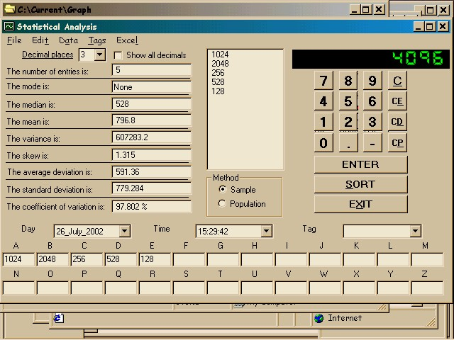



## Stats To DB

### Description

Digital Statistics Calculator saves all entered data to a

DAO database and can send it to Excel for graphing. The

lab where I work wanted this to avoid doing double data

entry.
 
### More Info
 

             |
---                |---
**Submitted On**   |2002-07-26 15:24:56
**By**             |[D\.W\.](https://github.com/Planet-Source-Code/PSCIndex/blob/master/ByAuthor/d-w.md)
**Level**          |Intermediate
**User Rating**    |5.0 (30 globes from 6 users)
**Compatibility**  |VB 6\.0
**Category**       |[Databases/ Data Access/ DAO/ ADO](https://github.com/Planet-Source-Code/PSCIndex/blob/master/ByCategory/databases-data-access-dao-ado__1-6.md)
**World**          |[Visual Basic](https://github.com/Planet-Source-Code/PSCIndex/blob/master/ByWorld/visual-basic.md)
**Archive File**   |[Stats\_To\_D1111457262002\.zip](https://github.com/Planet-Source-Code/d-w-stats-to-db__1-37284/archive/master.zip)

